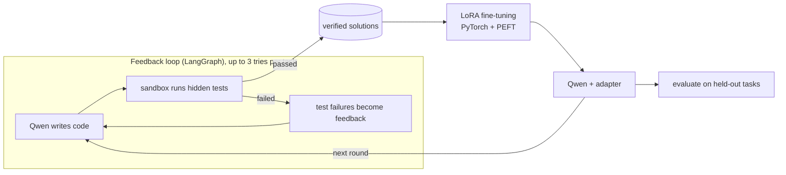

# AgentEval: Teaching a Small Coding Model with Its Own Verified Code

A small open-weight model, **Qwen2.5-Coder-0.5B-Instruct**, writes Python functions. A sandbox runs hidden tests on each one, and failures are turned into feedback for a retry. The code that passes becomes training data for a LoRA adapter, and the retrained model is measured on problems it has never seen.

**Result:** after one round of self-training, held-out pass@1 went from **5% to 35%** (+6 tasks gained, 0 lost, exact McNemar p = 0.031).

Why a small model: frontier models already pass most code challenges like these on the first try, so there is nothing left for them to learn. A 0.5B model fails often, has room to improve, and is cheap enough to fine-tune on a free GPU.

## How it works



Each self-training round:
1. **Evaluate** the current model on held-out tasks it never trains on.
2. **Collect:** run the feedback loop on training tasks, so the model writes code, gets test feedback and retries.
3. **Filter:** keep only code that passed every hidden test. The sandbox is the grader, so no data is labeled by hand.
4. **Train** a fresh LoRA adapter on the verified solutions. Only about 2% of the weights are trainable (8.8M of 503M); the base model stays frozen.
5. **Repeat** with the improved model, which solves more training tasks and so produces more training data.

The training data has three kinds of example: first-try passes, **repairs** (failing code + feedback → the fix that passed) and **distilled retries** (the original prompt → code that passed later). This approach is known as expert iteration or rejection-sampling fine-tuning.

## Results

Qwen2.5-Coder-0.5B-Instruct, 2 rounds, 20 training tasks collected per round, evaluated on 20 held-out and 20 easy-suite tasks, full feedback, 3 tries, `--warm-start`. Trained on a free Google Colab T4 GPU in about 8 minutes per round.

```
round  suite    examples repairs   pass@1    final  recovery    loss   vs round 0 (pass@1: +gained/-lost, McNemar p)
    0  heldout         0       0     5.0%     5.0%      0.0%       -
    0  easy            0       0     5.0%    10.0%      5.3%       -
    1  heldout       350       0    35.0%    35.0%      0.0%   0.045   +6/-0  p=0.0312
    1  easy          350       0     5.0%    10.0%      5.3%   0.045   +1/-1  p=1
    2  heldout       355       0    35.0%    35.0%      0.0%   0.002   +6/-0  p=0.0312
    2  easy          355       0    10.0%    10.0%      0.0%   0.002   +2/-1  p=1
```

| | Round 0 | Round 1 |
|---|---|---|
| Training tasks solved during collection | 20% | 75% |
| Model's own verified solutions added to the next round's data | 4 | 19 |

What this shows:
- **Self-training improves the model on unseen problems.** Held-out pass@1 went from 5% to 35%, and every task that changed flipped from fail to pass (p = 0.031). Round 2 held the gain but didn't add to it.
- **The loop feeds itself.** The trained model solved far more training tasks, so round 2 trained on 19 of its own verified solutions instead of 4.
- **The gain came from verified solutions, not from feedback.** The `repairs` column is 0 and held-out recovery is 0%: the 0.5B model never fixed its code after reading a test failure. Round 1's data was 346 warm-start reference solutions plus 4 of the model's own passes.
- **It didn't transfer to the hand-written easy suite** (5% → 10%, p = 1). The held-out tasks come from the same 38 generated problem families as training; the easy suite is written differently.
- **The 75% collection rate is inflated,** because with `--warm-start` the model trained on those tasks' reference solutions.
- **The sample is small** (20 tasks per suite), so treat the size of the jump as rough even though it is significant.

### Next: testing whether feedback teaches the model

The original claim is that *feedback* is what teaches the model. This run can't show that, because the 0.5B model produced no repairs. Planned steps:
1. **A bigger model.** Check whether Qwen2.5-Coder-1.5B recovers from feedback (`--feedback-level full` vs. `none`) on a GPU.
2. **Repair examples from mutants.** Every task ships buggy *mutants*. Running each one in the sandbox gives a real test failure, so "buggy code + real error → fixed code" can be generated for hundreds of tasks, teaching the model to use feedback directly.
3. **A controlled experiment.** Run `fb-full` against `fb-none`, identical except for feedback, and compare them with `compare-experiments`.

## Design decisions

**Correctness is deterministic.** A task passes only if every hidden test passes in the sandbox. A model is never asked whether code is correct, so every training label is ground truth.

**The sandbox reports each failure as a result, never an exception.** Each attempt runs in a fresh temp directory under `python -I -S`:
- isolated mode with no site-packages, so the code gets the stdlib only;
- an environment stripped to an allowlist;
- POSIX rlimits on CPU, memory and file size;
- its own process group, killed as a whole on the global timeout.

Each test gets its own SIGALRM timeout, raised as a `BaseException` so `except Exception` in generated code can't swallow it. Every `assert actual == expected` is rewritten through the AST so failures report expected vs. actual values. Every failure is classified: `syntax_error`, `import_error`, `missing_entry_point`, `timeout`, `memory_error`, `runtime_error`, `wrong_answer` or `crash`.

**Hidden-test policy.** The model never sees the test file. Full feedback shows, for up to 5 failing tests, the test name, the failing assertion, expected vs. actual values and a trimmed traceback, which is what a developer sees in a pytest report.

**Feedback is an experimental variable.** Four levels (`none`, `minimal`, `names`, `full`) make "does feedback help?" a measured result rather than a claim.

**The loop is an explicit graph.** LangGraph models `generate → test → (passed or out of tries ? END : feedback → generate)`, with the stopping rule as a named, unit-tested function.

**No train/test contamination.** Training and held-out tasks are built from one pool and deduplicated by solution fingerprint, so no problem repeats in training and no held-out problem appears there. `selftrain` refuses to run if the training and eval suites share a task.

**The tests are tested.** Every task has a reference solution and 2–6 buggy mutants (off-by-one errors, ignored edge cases, wrong tie-breaking, infinite loops). Every reference must pass and every mutant must be caught, giving a 100% mutation score. If the tests couldn't tell a bug from a fix, the pass rates would mean nothing.

**Every comparison is paired and comes with statistics.** Rounds are compared task by task with an exact McNemar test on first-try and final outcomes, so "it improved" always comes with a p-value.

## Task suites

| Suite | Tasks | Role |
|---|---|---|
| `train` (`tasks/tasks_train.json`) | 346 generated tasks, 38 families, 1,141 mutants | Self-training data only |
| `heldout` (`tasks/tasks_heldout.json`) | 110 generated tasks, same families, 365 mutants | Measures generalization; never trained on |
| `easy` (`tasks/tasks.json`) | 20 hand-written tasks, 88 mutants | A differently-written test of transfer |
| `hard` (`tasks/tasks_hard.json`) | 20 hand-written tasks, 102 mutants | Bug-fixing, stateful classes, long specs, performance limits |

## Setup

Requires Python ≥ 3.12.

```bash
python3.13 -m venv venv && source venv/bin/activate
pip install -r requirements.txt -r requirements-ml.txt
python main.py init-db
```

### Hardware

- **An 8 GB Apple Silicon Mac** can run generation (about 17 s per task on MPS), but LoRA training stalled on its first step for over an hour, swapping memory. The fp32 model, Qwen's 151k-token vocabulary and macOS don't fit in 8 GB together.
- **Train on a CUDA GPU instead.** A free Google Colab T4 runs a round's training in about 8 minutes.

### Running on Google Colab

Runtime → Change runtime type → T4 GPU, then:

```bash
!git clone https://github.com/shreykumar12/agent-feedback-loop   # private repo: https://<user>:<token>@github.com/...
%cd agent-feedback-loop
!pip install -q -r requirements.txt -r requirements-ml.txt
# Colab's preinstalled torch add-ons are built for its older torch and break transformers' imports
!pip uninstall -y torchvision torchaudio torchcodec torchao
!python -c "from transformers import BloomPreTrainedModel; import peft; print('imports OK')"
!python main.py init-db
!TRANSFORMERS_VERBOSITY=error LOCAL_MAX_NEW_TOKENS=1024 TEMPERATURE=0.7 python main.py selftrain \
    --model hf:Qwen/Qwen2.5-Coder-0.5B-Instruct --experiment my-run --rounds 2 \
    --train-tasks 20 --eval-tasks 20 --warm-start
!python main.py curve my-run
```

pip prints dependency-conflict warnings about Colab's own packages; they don't matter. Results live in `data/agent_eval.db` inside the Colab session, so **download it before the session ends**. Put it in `data/` locally to use `curve`, `report` or the dashboard.

### Settings that matter

- **`LOCAL_MAX_NEW_TOKENS=1024`:** at 384, code got cut off mid-function and most attempts were syntax errors.
- **`TEMPERATURE=0.7`:** at temperature 0, retries resubmit identical code (35 of 40 retries were stuck in one run), so the loop can't help.
- **`--warm-start`:** the base model solves almost no training tasks on its own, so round 1 is also trained on the training tasks' reference solutions to bootstrap. That's supervised data, not self-generated, so report it.
- **`TRANSFORMERS_VERBOSITY=error`** hides the library's warning spam.

## Usage

```bash
# One run of the feedback loop with Qwen
python main.py run --model hf:Qwen/Qwen2.5-Coder-0.5B-Instruct --suite heldout --feedback-level full
python main.py show latest                    # metrics summary
python main.py attempts latest <task_id>      # every attempt, its feedback and code

# Self-training rounds and the learning curve
python main.py selftrain --model hf:Qwen/Qwen2.5-Coder-0.5B-Instruct --experiment fb-full \
    --rounds 2 --train-tasks 100 --feedback-level full --warm-start
python main.py curve fb-full

# Control: the same run without feedback, then a paired comparison of the final models
python main.py selftrain --model hf:Qwen/Qwen2.5-Coder-0.5B-Instruct --experiment fb-none \
    --rounds 2 --train-tasks 100 --feedback-level none --warm-start
python main.py compare-experiments fb-full fb-none

# Use a trained adapter directly
python main.py run --model hf:Qwen/Qwen2.5-Coder-0.5B-Instruct+adapters/fb-full/round_1 --suite heldout

# Reports, dashboard, tests
python main.py report
streamlit run dashboard/app.py                # includes a Self-training tab
pytest
```

## Metrics

| Metric | Meaning |
|---|---|
| **pass@1** | First-attempt pass rate, with no feedback: the main measure of what training taught |
| **final pass rate** | Pass rate after all tries, with a Wilson 95% interval |
| **recovery rate** | Share of first-try failures fixed after feedback: whether the model uses feedback |
| **repairs** | Fail → feedback → fix examples found in a round's training data |
| **gained / lost, McNemar p** | Tasks that flipped vs. round 0, and whether the change could be chance |
| **error transitions** | Verdict on try k → try k+1 (e.g. `syntax_error → wrong_answer`) |
| **stuck retries** | Retries that resubmitted identical code |

## Project layout

```
agent_eval/          sandbox, harness, feedback, prompts, LangGraph loop, storage, metrics,
                     statistics, task suites, reports
agent_eval/ml/       PyTorch: Qwen through LangChain (local_model.py), SFT data (sft.py),
                     LoRA training (finetune.py), self-training rounds (selftrain.py)
tasks/               train, held-out, easy and hard suites (prompts, hidden tests,
                     reference solutions, mutants)
dashboard/app.py     Streamlit dashboard
tests/               pytest suite (176 tests; the ML tests use a tiny locally built model)
main.py              CLI
```

## Limitations

- **Small scale.** One 0.5B model, 2 rounds, 20 eval tasks per suite. The held-out gain is significant but relied on `--warm-start` and didn't transfer to the easy suite.
- **The feedback claim is untested so far.** At 0.5B, recovery after a failed first try was 0–5%, and the model produced no repairs. Earlier runs showed habits that waste retries: calling undefined helpers, printing at module level and pasting the error text back into its code.
- **The sandbox is not strong isolation.** rlimits and a stripped environment stop accidents (infinite loops, memory blowups), not an adversary. For untrusted models, run each attempt in Docker, gVisor or Firecracker.
- **Generated tasks share structure.** The held-out tasks are new problems from the training families, which is why the easy suite is kept as a test of transfer.
