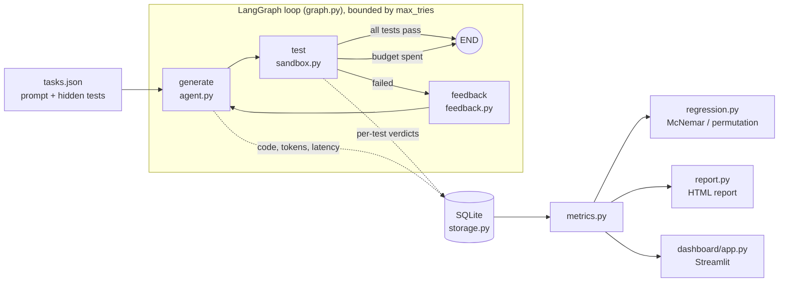
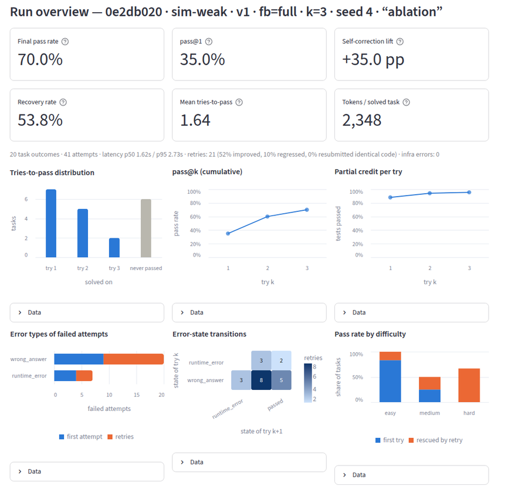

# AgentEval: Self-Correcting Coding Agent

An LLM writes a Python function, a sandbox runs hidden tests against it, and the failures are turned into feedback for the next attempt. The loop stops after a fixed try budget. Every attempt is stored so runs can be measured and compared.

**The agent is a component; the engineering is the loop.** The model is swappable by config. The real work is in five parts:

1. Running untrusted code safely.
2. Scoring correctness deterministically.
3. Turning test failures into feedback the agent can act on.
4. Bounding the retry loop.
5. Measuring whether a change to the model, prompt or feedback made things better or worse.


## Self-correcting, and optionally self-improving

Within one task the agent is **self-correcting**: it uses test feedback to repair its own answer over a few bounded tries. A single run is never **self-improving**: nothing learned on one task carries over to the next. There is no memory or prompt rewriting between tasks, so every run stays a clean, comparable measurement.

Self-improvement is a separate, explicit step on top of that, using PyTorch (see [Self-improvement with PyTorch](#self-improvement-with-pytorch)). A local model runs the loop on *training* tasks, and its sandbox-verified successes and repairs become fine-tuning data for a LoRA adapter. The next round's model is then measured on the held-out eval suites. Each round is a new, versioned model, and the same regression detector judges whether it actually got better.

## Architecture



| Module | Role |
|---|---|
| `agent_eval/sandbox.py`, `_harness.py` | Runs candidate code in an isolated subprocess and returns a verdict per test |
| `agent_eval/feedback.py` | Turns test results into feedback at level `none` / `minimal` / `names` / `full` |
| `agent_eval/prompts.py` | Versioned prompt sets (`v1`, `v2`) |
| `agent_eval/agent.py` | Provider-agnostic `generate()`: any OpenAI-compatible endpoint (Gemini by default) or the offline simulator |
| `agent_eval/simulated.py` | Deterministic offline `sim-*` models, so the pipeline runs without an API key |
| `agent_eval/graph.py` | The generate → test → feedback state machine, with the stopping rule as a conditional edge |
| `agent_eval/storage.py` | SQLite history of runs, attempts, feedback and per-test results |
| `agent_eval/metrics.py` | pass@k, lift, recovery, error transitions, retry dynamics, cost |
| `agent_eval/regression.py` | Paired run comparison with significance tests |
| `agent_eval/tasks.py` | Task loader, suite fingerprint, mutation-score validator |
| `agent_eval/judge.py` | Optional LLM judge for readability and approach (never correctness) |
| `agent_eval/report.py` | Self-contained HTML report |
| `dashboard/app.py` | Interactive Streamlit dashboard |
| `agent_eval/training_tasks.py` | Procedural training-task generator (38 families), kept separate from the eval suites |
| `agent_eval/ml/local_model.py` | Local Hugging Face/PyTorch models served through LangChain (`hf:<model>[+<adapter>]`) |
| `agent_eval/ml/verifier.py` | A pass/fail verifier written from scratch in PyTorch, used to rerank best-of-N candidates |
| `agent_eval/ml/sft.py`, `finetune.py`, `selftrain.py` | Verified trajectories → LoRA fine-tuning → self-training rounds with a learning curve |

## Design decisions

**Correctness is deterministic, and the LLM judge is secondary.** A task passes only if every hidden test passes in the sandbox. An LLM is never asked whether code is correct: that would be slow, costly, inconsistent between runs, and easy to game. The optional judge (`--judge`) scores readability and approach on an anchored 1–5 rubric with structured output. It runs only on code that already passed, and it returns nothing on any error. Cheap, reproducible static metrics (lines of code, cyclomatic complexity, nesting) are always recorded as well.

**The sandbox reports each failure as a result, never an exception.** Each attempt runs in a fresh temp directory under `python -I -S`:
- isolated mode, with no site-packages, so the code gets the stdlib only;
- an environment stripped to an allowlist, so API keys never reach generated code;
- POSIX rlimits on CPU, memory and file size;
- its own process group, killed as a whole on the global timeout.

Each test gets its own SIGALRM timeout, raised as a `BaseException` so `except Exception` in generated code can't swallow it. Results stream out as JSON lines, so partial results survive a killed process. Every `assert actual == expected` is rewritten through the AST so failures report expected vs. actual values, as pytest does. Every failure is classified: `syntax_error`, `import_error`, `missing_entry_point`, `timeout`, `memory_error`, `runtime_error`, `wrong_answer` or `crash`.

**Hidden-test policy.** The agent never sees the test file. Full feedback shows, for up to 5 failing tests, the test name, the single failing assertion line, expected vs. actual values, and a trimmed traceback. That is what a developer sees in a pytest report. There is special guidance for timeouts ("likely an infinite loop"), syntax errors and import errors ("stdlib only"). Feedback is truncated to about 3.5k characters.

**Feedback is an experimental variable.** The four levels (`none`, `minimal`, `names`, `full`) make "does richer feedback help?" a measured result instead of a claim. The first attempt never sees feedback, so for a fixed seed pass@1 is identical across levels and the ablation is a paired experiment.

**The loop is an explicit graph.** LangGraph models `generate → test → (passed | tries ≥ max_tries ? END : feedback → generate)`. The stopping rule is a named function (`route_after_test`) with its own unit test, not a condition buried in a while-loop.

**The suite is validated too.** Each of the 20 original tasks ships a reference solution and 3–6 plausible buggy *mutants* (off-by-one errors, ignored edge cases, wrong tie-breaking, crashes, infinite loops, syntax or import errors). `validate-tasks` and the test suite require every reference to pass and every mutant to be caught: **mutation score 100% (88/88)**. If the tests can't tell a subtle bug from a fix, the pass rates mean nothing. `suite_hash` fingerprints prompts and tests, and `compare` warns if two runs weren't scored on the same suite.

**Comparisons are paired and carry statistics.** Runs are compared task by task. The detector flags a regression if any task newly fails, if pass rate drops more than 5 pp, if pass@1 drops more than 10 pp, or if mean tries rises by more than 0.5. Every flag comes with an exact McNemar test on the discordant tasks, for both final pass and first-try pass, and a paired bootstrap interval. Repeated runs (`--seeds N`) can be compared as groups, using an exact permutation test and a pooled (seed, task) McNemar test.

**Offline simulator.** No API key? The `sim-strong`, `sim-base` and `sim-weak` models "write" either a task's reference solution or one of its mutants. A failure lowers the chance of fixing the task on a blind retry, and feedback can only raise it. The simulator reads the feedback text: with full feedback it turns the shown assertions into probe tests and runs its candidate fixes against them in the sandbox. Its results are a demonstration of the measurement system, **not claims about any real LLM**.

## Task suites

The easy suite is useful as a baseline, but classic "write a function from a docstring" problems are saturated: frontier models pass nearly all of them on the first try, which leaves the retry loop nothing to measure. The hard suite targets the ways strong models actually fail.

| Suite | Tasks | Hidden tests | Mutants | What it contains |
|---|---|---|---|---|
| `easy` (`tasks/tasks.json`) | 20 (6 easy, 8 medium, 6 hard) | 164 | 88 | Function-from-docstring problems with a few trap conventions |
| `hard` (`tasks/tasks_hard.json`) | 20 (16 hard, 4 medium) | 269 | 102 | Five tasks in each of four categories, below |

Hard-suite categories:
- **Bug-fixing:** 40–120 lines of realistic, buggy production-style code with a symptom-only bug report. Examples: refund cent allocation, keyset pagination, semver ranges, SLA business-hour deadlines, config deep merge. The original buggy code and plausible partial fixes are among the mutants.
- **Stateful classes:** a token-bucket rate limiter, a limit order book, a nested-transaction key-value store, a coalescing undo buffer, a card-hold ledger. Tests drive long call sequences with an injected clock.
- **Long specs:** a semver range matcher, a template engine, RFC 6902 JSON Patch, cron next-fire time, a TOML-subset parser. They have 15+ interacting rules, each one tested.
- **Performance:** inputs of 10⁵–10⁶ under a 1.5 s per-test limit. A correct but quadratic solution times out, so the agent has to read the timeout feedback and change algorithms.

Every task in both suites has a reference solution and mutants. `pytest` and CI require every reference to pass and every mutant to be caught, so both suites have a 100% mutation score. Runs record their suite, and every comparison, report and dashboard view keys on it, so easy and hard results never mix. Each run's summary also breaks pass@1 and the final pass rate down by category.

## Self-improvement with PyTorch

The loop's own ground truth (sandbox verdicts on thousands of attempts) is training data. Three PyTorch components use it, alongside the LangChain/LangGraph stack, not instead of it:

| Layer | Tool | Role |
|---|---|---|
| Orchestration | LangGraph | The bounded generate → test → feedback loop (unchanged) |
| Model interface | LangChain | One `invoke()` over Gemini (`ChatOpenAI`) and local PyTorch models (`ChatHuggingFace`) |
| Models and training | PyTorch + Hugging Face + PEFT | Local inference, LoRA self-training, the from-scratch verifier |
| Correctness | Sandbox + hidden tests | The ground truth every label and metric comes from |

**1. Local models (`--model hf:<repo-or-path>[+<adapter>]`).** Any Hugging Face causal LM, e.g. `hf:Qwen/Qwen2.5-Coder-0.5B-Instruct`, loads once per process on CUDA, Apple Silicon (MPS) or CPU. It runs through LangChain's `ChatHuggingFace`, so prompts, extraction, the sandbox and every metric work unchanged. A `+<adapter-dir>` suffix loads a LoRA adapter from self-training.

**2. A learned verifier, written from scratch.** `agent_eval/ml/verifier.py` predicts whether code will pass the hidden tests *without running it*. It uses no pretrained weights:
- a byte tokenizer
- a byte-patch embedding that groups 4 bytes into one token, making attention about 16× cheaper
- hand-written multi-head self-attention blocks
- [CLS] + mean + max pooling into a single logit

Training uses a pairwise ranking loss (a task's passing program should score above its failing ones), plus a little class-balanced BCE to keep scores calibrated. Code is normalized through the AST (docstrings and comments stripped) so the byte budget goes to logic. Without that, 22–73% of pass/fail pairs truncated to *identical* inputs with opposite labels, a data bug found while debugging a flat loss curve. Splits are by task, and the test set is the eval suites, which it never sees in training. In the loop, `--candidates N --verifier PATH` samples N programs per attempt and sends only the verifier's top pick to the sandbox. Candidate 1 is always the normal single-sample output, so best-of-N vs. single-sample is a paired comparison.

**3. Self-training (expert iteration).** `python main.py selftrain` runs rounds of:
1. evaluate on the held-out suites
2. run the loop on training tasks
3. turn verified successes into fine-tuning data
4. train a fresh LoRA adapter
5. evaluate again

The fine-tuning data has three kinds of example: first-try passes, **repairs** (failing code + feedback → the fix that passed, which teaches the model to use feedback), and **distilled retries** (the first prompt → code that only passed later). Only sandbox-verified code is ever a training target. The training suite (`tasks/tasks_train.json`) is 400 procedurally generated tasks from 38 families, validated like the eval suites (1,340 mutants, all caught), with no overlap with them. `selftrain` refuses to run if the training and eval suites share a task. Each round is stored, and `python main.py curve`, the report and the dashboard's Self-training tab show the learning curve.

**On an 8 GB Apple Silicon Mac:** a 0.5B model (e.g. Qwen2.5-Coder-0.5B-Instruct) fits for both generation and LoRA training, in fp32 with gradient checkpointing. 1.5B models are better trained on a CUDA GPU (e.g. Colab). The verifier trains in minutes on CPU and faster on MPS.

```bash
pip install -r requirements.txt -r requirements-ml.txt

# Learned verifier: train on generated tasks, test on the held-out eval suites
python main.py train-verifier --train-suites train --eval-suites easy hard --out models/verifier.pt
python main.py run --model sim-weak --candidates 5 --verifier models/verifier.pt --seeds 5

# Local model through LangChain, then self-training rounds
python main.py run --model hf:Qwen/Qwen2.5-Coder-0.5B-Instruct --tasks caesar_shift clamp_all
python main.py selftrain --model hf:Qwen/Qwen2.5-Coder-0.5B-Instruct --experiment qwen05-r3 \
    --rounds 3 --train-tasks 200 --warm-start
python main.py curve qwen05-r3

# Regenerate the training suite (deterministic)
python main.py gen-train-tasks --n 400 --seed 0
```

## Setup

Requires Python ≥ 3.12, because the pinned dependencies need it.

```bash
python3.13 -m venv venv && source venv/bin/activate
pip install -r requirements.txt
cp .env.example .env        # add GEMINI_API_KEY for real runs (optional)
python main.py init-db
```

## Usage

```bash
# Offline, no key needed: the simulated agent runs the full pipeline in about 2 s
python main.py run --model sim-base
python main.py show latest                 # full metrics summary
python main.py attempts latest rank_players  # attempts, feedback and code for one task

# Real model (Gemini through its OpenAI-compatible endpoint)
python main.py run --model gemini-3.8-flash --prompt-version v1 --feedback-level full
python main.py run --model gemini-3.8-flash --prompt-version v2 --seeds 3 --judge
python main.py run --model gemini-3.8-flash --rpm 5          # pace a rate-limited (free-tier) key

# The hard suite (bug-fixing, stateful classes, long specs, performance limits)
python main.py run --model gemini-3.8-flash --suite hard
python main.py show latest                                   # includes the by-category breakdown
python main.py compare @sim-strong/full/v1/hard @sim-weak/full/v1/hard   # compare within one suite

# Feedback-level ablation: models x levels x seeds
python main.py ablation --models sim-strong sim-base sim-weak --seeds 5

# Regression detection (exit code 1 if a regression is flagged, for CI gating)
python main.py runs
python main.py compare <baseline_run_id> <candidate_run_id>   # prefixes, latest, latest~1 work
python main.py compare @sim-strong/full @sim-weak/full        # all seeds of two configs

# Reporting
python main.py report --compare <baseline> <candidate>        # writes reports/report.html
streamlit run dashboard/app.py

# Tests and the suite's own validity check
pytest
python main.py validate-tasks --suite easy
python main.py validate-tasks --suite hard
```



The dashboard has six tabs: run overview, configuration leaderboard and ablation, regression comparison, per-attempt task drill-down, per-task solve matrix, and code-quality metrics.

Any OpenAI-compatible endpoint works (OpenAI, OpenRouter, Ollama, vLLM): set `LLM_BASE_URL` and `LLM_API_KEY`. The sandbox limits, try budget and paths are all env-overridable (see `.env.example`).

## Metrics

| Metric | Meaning |
|---|---|
| **pass@1** | First-attempt pass rate, with no feedback |
| **pass@k** | Cumulative pass rate if the loop stopped after k tries |
| **final pass rate** | pass@max_tries, with a Wilson 95% interval |
| **self-correction lift** | final − pass@1: what the loop buys |
| **recovery rate** | Share of first-try failures that were later fixed |
| **tries-to-pass** | Distribution and mean among solved tasks |
| **marginal gain per try** | pass@k − pass@(k−1): do retries plateau? |
| **error-state transitions** | Verdict on try k → verdict on try k+1 (e.g. `runtime_error → wrong_answer`) |
| **partial credit per try** | Mean share of tests passed at each try: is the agent converging? |
| **retry outcomes** | Whether each retry improved, stayed the same or regressed the test-pass share; **stuck** = resubmitted identical code |
| **edit ratio** | How much code changed between tries: a targeted fix or a rewrite |
| **cost** | Tokens in/out, estimated USD (priced models), tokens per solved task, latency p50/p95 |

## Results

> **Read this first:** there was no API key in the environment where these numbers were produced, so they come from the offline **simulated** agent (60 suite runs: 3 sim models × 4 feedback levels × 5 seeds). They show what the system measures and how the analysis reads; they are not benchmark results for a real LLM. `python main.py ablation --models gemini-3.8-flash --seeds 3` produces the real version.

### Feedback-level ablation (final pass rate, mean ± sd over 5 seeds, max 3 tries)

| model | pass@1 | none | minimal | names | full |
|---|---|---|---|---|---|
| sim-strong | 73.0% ± 11.0 | 85.0% ± 11.7 | 85.0% ± 11.7 | 97.0% ± 4.5 | **100.0% ± 0.0** |
| sim-base | 60.0% ± 14.1 | 82.0% ± 11.0 | 82.0% ± 11.0 | 92.0% ± 7.6 | **96.0% ± 6.5** |
| sim-weak | 41.0% ± 9.6 | 59.0% ± 10.8 | 59.0% ± 10.8 | 77.0% ± 12.0 | **87.0% ± 11.0** |

- Richer feedback raises the final pass rate at every model strength, and it matters most for the weakest model: +28 pp from minimal to full for sim-weak, against +15 pp for sim-strong.
- With content-free feedback (`none` / `minimal`), 41% of retries resubmit identical code. With `names` or `full`, almost none do.
- `none` and `minimal` coincide here because neither carries information the simulator can use. With a real model, the difference measures whether knowing "tests failed" changes behavior at all.
- Paired over (seed, task), downgrading sim-base from `full` to `minimal` loses 14 tasks and gains 0 (McNemar p = 1.2e-4).

### Tries-to-pass and error transitions (sim-base, full feedback, 5 seeds × 20 tasks)

- Solved on try 1: 60, try 2: 28, try 3: 8, never: 4. Most of the lift arrives on the first retry; the third try adds 8 pp.
- Most common transitions: `wrong_answer → passed` 28, `runtime_error → passed` 7, `wrong_answer → runtime_error` 5, `runtime_error → wrong_answer` 4. Of 52 retries, 41 improved the test-pass share, 7 stayed flat and 4 regressed.
- Hardest tasks by first-try rate across all 60 runs: `max_booking_value` 20%, `evaluate_expression` 27%, `shortest_path` 27%, `lru_simulate` 33%, `window_maxima` 33%.

### Example regression comparison: model swap sim-strong → sim-weak (seed 0, full feedback)

```
metric                    baseline   candidate       delta
pass_rate                   100.0%       90.0%      -10.0%
pass_at_1                    70.0%       30.0%      -40.0%
self_correction_lift         30.0%       60.0%      +30.0%
mean_tries_to_pass            1.30        1.83       +0.53
McNemar exact p (final pass): 0.500 (not significant)
McNemar exact p (pass@1):     0.021 (significant; first-try lost 9, gained 1)
newly failing (2): parse_duration, shortest_path
VERDICT: REGRESSION
```

**The loop masks regressions.** The final pass rate fell only 10 pp, because retries rescued most of the weaker model's failures, while pass@1 fell 40 pp. A detector that watched only the final pass rate would call this a small, insignificant change. That is why `compare` tests first-try outcomes separately. Over all 5 seeds (`compare @sim-strong/full @sim-weak/full`), pass@1 drops 32 pp with permutation p = 0.016.

**Noise is real.** An A/A comparison of *the same configuration* with seed 0 vs. seed 1 trips the single-run pass@1 threshold (−20 pp) purely by chance. The group comparison of seeds {0, 1} vs. {2, 3, 4} correctly reports no significant regression. On a 20-task suite, don't call a regression from one run: use `--seeds`.

## Testing

`pytest` runs 147 tests in about 100 s, with no API key, so CI runs them on every push:
- **Sandbox:** timeouts that `except Exception` can't swallow, the global kill backstop, memory limit, secret stripping, isolation between runs, `sys.exit`.
- **Feedback:** content at each level, truncation, and the hidden-test policy.
- **Graph:** a scripted fake agent covers first-try pass, pass after retries, the max-tries stop, and that retry prompts receive the previous code and feedback.
- **Storage:** round-trips.
- **Metrics and regression:** hand-built runs with known answers, plus the McNemar, permutation and bootstrap math.
- **Task suite validity:** in both suites, every reference solution passes and every mutant is caught; performance tasks must declare a time limit; task ids are unique across suites.
- **Suites:** easy-suite prompts render exactly as before, old databases migrate in place, and per-task time limits apply.
- **Simulator:** more information never lowers the pass rate.
- **Report and dashboard:** smoke tests.

## Limitations

- **The subprocess sandbox is not strong isolation.** rlimits and a stripped environment stop accidents (infinite loops, memory blowups, leaked keys), not an adversary. The code can still read the filesystem and open network sockets. `RLIMIT_NPROC` is not set because it is per-user. For untrusted models, run each attempt in Docker, gVisor or Firecracker.
- **A small suite means noisy metrics.** With 20 tasks, one flipped task moves the pass rate by 5 pp and the 95% interval on a single run is about ±20 pp (13/20 → 43–82%). Even at temperature 0, provider-side nondeterminism means two identical runs can differ. Repeat runs, and prefer the paired and group tests over raw deltas.
- **Benchmark contamination.** The tasks were written for this project rather than copied from HumanEval or MBPP, but the easy suite is HumanEval-*style*, and close variants likely exist in training data. Pass@1 on classic problems overstates ability on novel ones. The hard suite reduces this, since its bug-fix code, class specs and rule sets are original, but it doesn't eliminate it: semver, cron and JSON Patch are well-known standards.
- **The verifier sees code, not behavior.** It never executes anything, so it can only learn bug patterns that show up in the text. Long programs are truncated at 2,048 normalized bytes, which still makes 28% of the hard suite's pass/fail pairs indistinguishable to it. Treat it as a reranker that biases sampling, never as a replacement for the hidden tests.
- **Self-training hasn't been run on a real model in this repo yet.** The development environment had no access to Hugging Face, so the pipeline is tested end to end with a tiny locally built model. Learning-curve numbers for a real model need a run on your machine. Small models also start near 0% on the hard suite, so `--warm-start` (supervised on training-task references) may be needed before they produce enough verified successes to learn from.
- **The hard suite is not a repository benchmark.** Each task is still a single module. Multi-file, SWE-bench-style repair tasks would need the sandbox to copy a repo and run its own test suite.
- **Simulated results are illustrative.** The `sim-*` models' behavior is designed. Only how feedback is used on a retry emerges from the feedback content, via the sandbox probes. The ablation shape above validates the pipeline, not a hypothesis about LLMs.
- **The judge is optional and unvalidated.** LLM quality scores are not checked against human ratings. Treat them as a weak signal; correctness never depends on them.
- **Cost figures** use a static price table in `config.py`. Check them against current provider pricing.

## Project layout

```
agent_eval/        package: sandbox, harness, feedback, prompts, agent, simulator, graph,
                   storage, metrics, regression, tasks, judge, report (+ HTML template)
dashboard/app.py   Streamlit dashboard
tasks/tasks.json   easy suite: 20 tasks (prompt, hidden tests, reference solution, mutants)
tasks/tasks_hard.json  hard suite: 20 bug-fix / stateful / spec / performance tasks
tests/             pytest suite (no API key needed)
docs/DEV_NOTES.md  design log and findings
main.py            CLI
```
