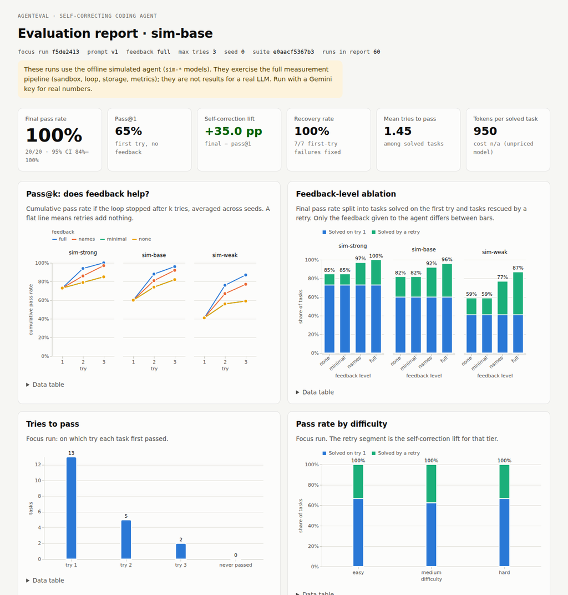
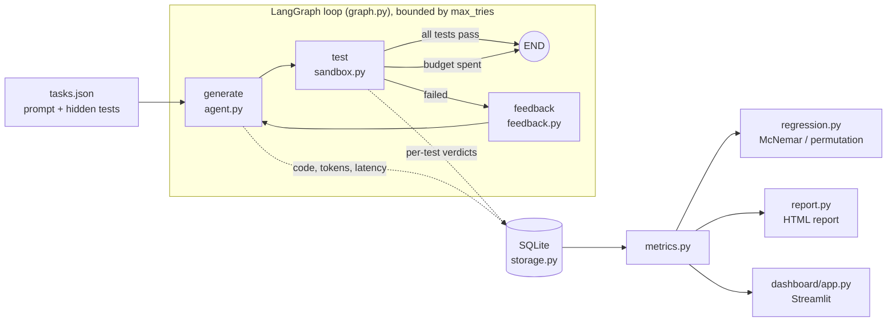

# AgentEval: Self-Correcting Coding Agent

An LLM writes a Python function, a sandbox runs hidden tests against it, and the failures are turned into feedback for the next attempt. The loop stops after a fixed try budget. Every attempt is stored so runs can be measured and compared.

**The agent is a component; the engineering is the loop.** The model is swappable by config. The real work is in five parts:

1. Running untrusted code safely.
2. Scoring correctness deterministically.
3. Turning test failures into feedback the agent can act on.
4. Bounding the retry loop.
5. Measuring whether a change to the model, prompt or feedback made things better or worse.



## Self-correcting, not self-improving

This agent is **self-correcting**: within one task, it uses test feedback to repair its own answer over a few bounded tries. It is **not self-improving**: nothing it learns on one task carries over to the next. There is no memory, fine-tuning, or prompt rewriting between tasks or runs.

Improvement across runs happens *outside* the agent. A human changes the model, prompt version or feedback level. The regression detector then says, with statistics, whether that change helped or hurt. That separation keeps every run a clean, comparable measurement.

## Architecture



| Module | Role |
|---|---|
| `agent_eval/sandbox.py`, `_harness.py` | Runs candidate code in an isolated subprocess and returns a verdict per test |
| `agent_eval/feedback.py` | Turns test results into feedback at level `none` / `minimal` / `names` / `full` |
| `agent_eval/prompts.py` | Versioned prompt sets (`v1`, `v2`) |
| `agent_eval/agent.py` | Provider-agnostic `generate()`: any OpenAI-compatible endpoint (Gemini by default) or the offline simulator |
| `agent_eval/simulated.py` | Deterministic offline `sim-*` models, so the pipeline runs without an API key |
| `agent_eval/graph.py` | The generate → test → feedback state machine, with the stopping rule as a conditional edge |
| `agent_eval/storage.py` | SQLite history of runs, attempts, feedback and per-test results |
| `agent_eval/metrics.py` | pass@k, lift, recovery, error transitions, retry dynamics, cost |
| `agent_eval/regression.py` | Paired run comparison with significance tests |
| `agent_eval/tasks.py` | Task loader, suite fingerprint, mutation-score validator |
| `agent_eval/judge.py` | Optional LLM judge for readability and approach (never correctness) |
| `agent_eval/report.py` | Self-contained HTML report |
| `dashboard/app.py` | Interactive Streamlit dashboard |

## Design decisions

**Correctness is deterministic, and the LLM judge is secondary.** A task passes only if every hidden test passes in the sandbox. An LLM is never asked whether code is correct: that would be slow, costly, inconsistent between runs, and easy to game. The optional judge (`--judge`) scores readability and approach on an anchored 1–5 rubric with structured output. It runs only on code that already passed, and it returns nothing on any error. Cheap, reproducible static metrics (lines of code, cyclomatic complexity, nesting) are always recorded as well.

**The sandbox reports each failure as a result, never an exception.** Each attempt runs in a fresh temp directory under `python -I -S`:
- isolated mode, with no site-packages, so the code gets the stdlib only;
- an environment stripped to an allowlist, so API keys never reach generated code;
- POSIX rlimits on CPU, memory and file size;
- its own process group, killed as a whole on the global timeout.

Each test gets its own SIGALRM timeout, raised as a `BaseException` so `except Exception` in generated code can't swallow it. Results stream out as JSON lines, so partial results survive a killed process. Every `assert actual == expected` is rewritten through the AST so failures report expected vs. actual values, as pytest does. Every failure is classified: `syntax_error`, `import_error`, `missing_entry_point`, `timeout`, `memory_error`, `runtime_error`, `wrong_answer` or `crash`.

**Hidden-test policy.** The agent never sees the test file. Full feedback shows, for up to 5 failing tests, the test name, the single failing assertion line, expected vs. actual values, and a trimmed traceback. That is what a developer sees in a pytest report. There is special guidance for timeouts ("likely an infinite loop"), syntax errors and import errors ("stdlib only"). Feedback is truncated to about 3.5k characters.

**Feedback is an experimental variable.** The four levels (`none`, `minimal`, `names`, `full`) make "does richer feedback help?" a measured result instead of a claim. The first attempt never sees feedback, so for a fixed seed pass@1 is identical across levels and the ablation is a paired experiment.

**The loop is an explicit graph.** LangGraph models `generate → test → (passed | tries ≥ max_tries ? END : feedback → generate)`. The stopping rule is a named function (`route_after_test`) with its own unit test, not a condition buried in a while-loop.

**The suite is validated too.** Each of the 20 original tasks ships a reference solution and 3–6 plausible buggy *mutants* (off-by-one errors, ignored edge cases, wrong tie-breaking, crashes, infinite loops, syntax or import errors). `validate-tasks` and the test suite require every reference to pass and every mutant to be caught: **mutation score 100% (88/88)**. If the tests can't tell a subtle bug from a fix, the pass rates mean nothing. `suite_hash` fingerprints prompts and tests, and `compare` warns if two runs weren't scored on the same suite.

**Comparisons are paired and carry statistics.** Runs are compared task by task. The detector flags a regression if any task newly fails, if pass rate drops more than 5 pp, if pass@1 drops more than 10 pp, or if mean tries rises by more than 0.5. Every flag comes with an exact McNemar test on the discordant tasks, for both final pass and first-try pass, and a paired bootstrap interval. Repeated runs (`--seeds N`) can be compared as groups, using an exact permutation test and a pooled (seed, task) McNemar test.

**Offline simulator.** No API key? The `sim-strong`, `sim-base` and `sim-weak` models "write" either a task's reference solution or one of its mutants. A failure lowers the chance of fixing the task on a blind retry, and feedback can only raise it. The simulator reads the feedback text: with full feedback it turns the shown assertions into probe tests and runs its candidate fixes against them in the sandbox. Its results are a demonstration of the measurement system, **not claims about any real LLM**.

## Setup

Requires Python ≥ 3.12, because the pinned dependencies need it.

```bash
python3.13 -m venv venv && source venv/bin/activate
pip install -r requirements.txt
cp .env.example .env        # add GEMINI_API_KEY for real runs (optional)
python main.py init-db
```

## Usage

```bash
# Offline, no key needed: the simulated agent runs the full pipeline in about 2 s
python main.py run --model sim-base
python main.py show latest                 # full metrics summary
python main.py attempts latest rank_players  # attempts, feedback and code for one task

# Real model (Gemini through its OpenAI-compatible endpoint)
python main.py run --model gemini-2.5-flash --prompt-version v1 --feedback-level full
python main.py run --model gemini-2.5-flash --prompt-version v2 --seeds 3 --judge

# Feedback-level ablation: models x levels x seeds
python main.py ablation --models sim-strong sim-base sim-weak --seeds 5

# Regression detection (exit code 1 if a regression is flagged, for CI gating)
python main.py runs
python main.py compare <baseline_run_id> <candidate_run_id>   # prefixes, latest, latest~1 work
python main.py compare @sim-strong/full @sim-weak/full        # all seeds of two configs

# Reporting
python main.py report --compare <baseline> <candidate>        # writes reports/report.html
streamlit run dashboard/app.py

# Tests and the suite's own validity check
pytest
python main.py validate-tasks
```

Any OpenAI-compatible endpoint works (OpenAI, OpenRouter, Ollama, vLLM): set `LLM_BASE_URL` and `LLM_API_KEY`. The sandbox limits, try budget and paths are all env-overridable (see `.env.example`).

## Metrics

| Metric | Meaning |
|---|---|
| **pass@1** | First-attempt pass rate, with no feedback |
| **pass@k** | Cumulative pass rate if the loop stopped after k tries |
| **final pass rate** | pass@max_tries, with a Wilson 95% interval |
| **self-correction lift** | final − pass@1: what the loop buys |
| **recovery rate** | Share of first-try failures that were later fixed |
| **tries-to-pass** | Distribution and mean among solved tasks |
| **marginal gain per try** | pass@k − pass@(k−1): do retries plateau? |
| **error-state transitions** | Verdict on try k → verdict on try k+1 (e.g. `runtime_error → wrong_answer`) |
| **partial credit per try** | Mean share of tests passed at each try: is the agent converging? |
| **retry outcomes** | Whether each retry improved, stayed the same or regressed the test-pass share; **stuck** = resubmitted identical code |
| **edit ratio** | How much code changed between tries: a targeted fix or a rewrite |
| **cost** | Tokens in/out, estimated USD (priced models), tokens per solved task, latency p50/p95 |

## Results

> **Read this first:** there was no API key in the environment where these numbers were produced, so they come from the offline **simulated** agent (60 suite runs: 3 sim models × 4 feedback levels × 5 seeds). They show what the system measures and how the analysis reads; they are not benchmark results for a real LLM. `python main.py ablation --models gemini-2.5-flash gemini-2.5-flash-lite --seeds 3` produces the real version.

### Feedback-level ablation (final pass rate, mean ± sd over 5 seeds, max 3 tries)

| model | pass@1 | none | minimal | names | full |
|---|---|---|---|---|---|
| sim-strong | 73.0% ± 11.0 | 85.0% ± 11.7 | 85.0% ± 11.7 | 97.0% ± 4.5 | **100.0% ± 0.0** |
| sim-base | 60.0% ± 14.1 | 82.0% ± 11.0 | 82.0% ± 11.0 | 92.0% ± 7.6 | **96.0% ± 6.5** |
| sim-weak | 41.0% ± 9.6 | 59.0% ± 10.8 | 59.0% ± 10.8 | 77.0% ± 12.0 | **87.0% ± 11.0** |

- Richer feedback raises the final pass rate at every model strength, and it matters most for the weakest model: +28 pp from minimal to full for sim-weak, against +15 pp for sim-strong.
- With content-free feedback (`none` / `minimal`), 41% of retries resubmit identical code. With `names` or `full`, almost none do.
- `none` and `minimal` coincide here because neither carries information the simulator can use. With a real model, the difference measures whether knowing "tests failed" changes behavior at all.
- Paired over (seed, task), downgrading sim-base from `full` to `minimal` loses 14 tasks and gains 0 (McNemar p = 1.2e-4).

### Tries-to-pass and error transitions (sim-base, full feedback, 5 seeds × 20 tasks)

- Solved on try 1: 60, try 2: 28, try 3: 8, never: 4. Most of the lift arrives on the first retry; the third try adds 8 pp.
- Most common transitions: `wrong_answer → passed` 28, `runtime_error → passed` 7, `wrong_answer → runtime_error` 5, `runtime_error → wrong_answer` 4. Of 52 retries, 41 improved the test-pass share, 7 stayed flat and 4 regressed.
- Hardest tasks by first-try rate across all 60 runs: `max_booking_value` 20%, `evaluate_expression` 27%, `shortest_path` 27%, `lru_simulate` 33%, `window_maxima` 33%.

### Example regression comparison: model swap sim-strong → sim-weak (seed 0, full feedback)

```
metric                    baseline   candidate       delta
pass_rate                   100.0%       90.0%      -10.0%
pass_at_1                    70.0%       30.0%      -40.0%
self_correction_lift         30.0%       60.0%      +30.0%
mean_tries_to_pass            1.30        1.83       +0.53
McNemar exact p (final pass): 0.500 (not significant)
McNemar exact p (pass@1):     0.021 (significant; first-try lost 9, gained 1)
newly failing (2): parse_duration, shortest_path
VERDICT: REGRESSION
```

**The loop masks regressions.** The final pass rate fell only 10 pp, because retries rescued most of the weaker model's failures, while pass@1 fell 40 pp. A detector that watched only the final pass rate would call this a small, insignificant change. That is why `compare` tests first-try outcomes separately. Over all 5 seeds (`compare @sim-strong/full @sim-weak/full`), pass@1 drops 32 pp with permutation p = 0.016.

**Noise is real.** An A/A comparison of *the same configuration* with seed 0 vs. seed 1 trips the single-run pass@1 threshold (−20 pp) purely by chance. The group comparison of seeds {0, 1} vs. {2, 3, 4} correctly reports no significant regression. On a 20-task suite, don't call a regression from one run: use `--seeds`.

## Testing

`pytest` runs over 100 tests in about 15 s, with no API key, so CI runs them on every push:
- **Sandbox:** timeouts that `except Exception` can't swallow, the global kill backstop, memory limit, secret stripping, isolation between runs, `sys.exit`.
- **Feedback:** content at each level, truncation, and the hidden-test policy.
- **Graph:** a scripted fake agent covers first-try pass, pass after retries, the max-tries stop, and that retry prompts receive the previous code and feedback.
- **Storage:** round-trips.
- **Metrics and regression:** hand-built runs with known answers, plus the McNemar, permutation and bootstrap math.
- **Task suite validity:** reference solutions pass, mutants are caught.
- **Simulator:** more information never lowers the pass rate.
- **Report and dashboard:** smoke tests.

## Limitations

- **The subprocess sandbox is not strong isolation.** rlimits and a stripped environment stop accidents (infinite loops, memory blowups, leaked keys), not an adversary. The code can still read the filesystem and open network sockets. `RLIMIT_NPROC` is not set because it is per-user. For untrusted models, run each attempt in Docker, gVisor or Firecracker.
- **A small suite means noisy metrics.** With 20 tasks, one flipped task moves the pass rate by 5 pp and the 95% interval on a single run is about ±20 pp (13/20 → 43–82%). Even at temperature 0, provider-side nondeterminism means two identical runs can differ. Repeat runs, and prefer the paired and group tests over raw deltas.
- **Benchmark contamination.** The tasks were written for this project rather than copied from HumanEval or MBPP, but they are HumanEval-*style* problems, and close variants likely exist in training data. Pass@1 on classic problems overstates ability on novel ones.
- **Simulated results are illustrative.** The `sim-*` models' behavior is designed. Only how feedback is used on a retry emerges from the feedback content, via the sandbox probes. The ablation shape above validates the pipeline, not a hypothesis about LLMs.
- **The judge is optional and unvalidated.** LLM quality scores are not checked against human ratings. Treat them as a weak signal; correctness never depends on them.
- **Cost figures** use a static price table in `config.py`. Check them against current provider pricing.

## Project layout

```
agent_eval/        package: sandbox, harness, feedback, prompts, agent, simulator, graph,
                   storage, metrics, regression, tasks, judge, report (+ HTML template)
dashboard/app.py   Streamlit dashboard
tasks/tasks.json   20 tasks: prompt, hidden tests, reference solution, mutants
tests/             pytest suite (no API key needed)
docs/DEV_NOTES.md  design log and findings
main.py            CLI
```
